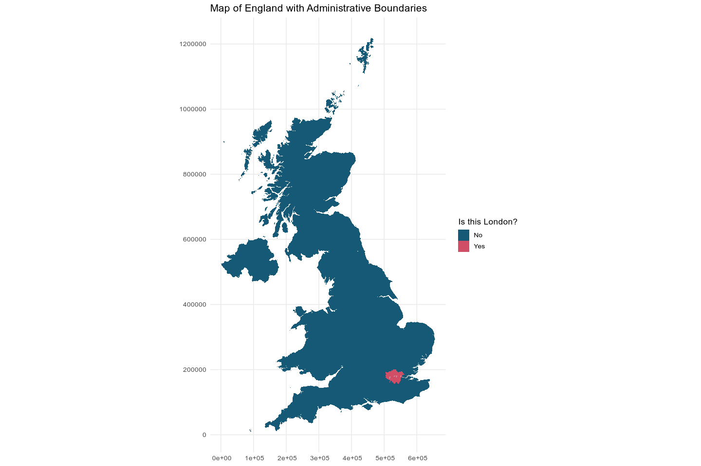
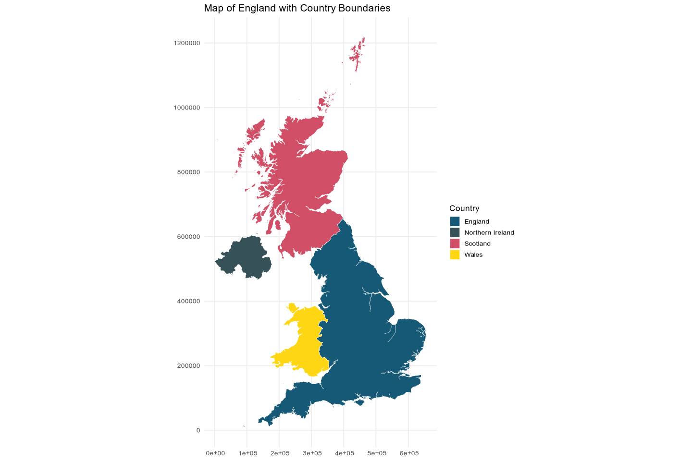
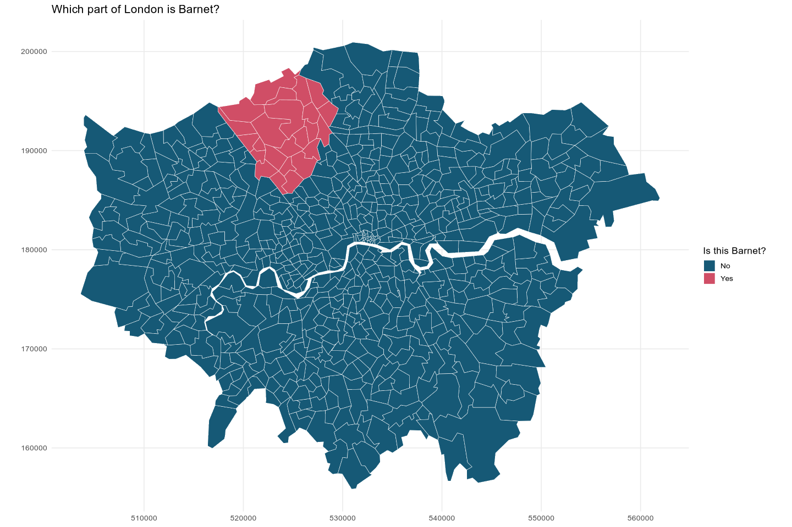

<!-- README.md is generated from README.Rmd. Please edit that file -->

# ukmaps 

<!-- badges: start -->

[](https://www.buymeacoffee.com/pacha)
<!-- badges: end -->

*If you need an R package or Shiny dashboard for your team, you can
email me or inquiry on
[Fiverr](https://www.fiverr.com/sellers/msepulveda3).*

Ukmaps provides simplified maps of the United Kingdom administrative and
electoral boundaries. Includes maps for England, Scotland, Wales, and
Northern Ireland.

This is a very early version of the package. More features and
boundaries will be added soon.

## Installation

You can install the development version of ukmaps like so:

``` r
remotes::install_github("pachadotdev/ukmaps")
```

## Examples

Yes/No map of London administrative areas:

``` r
library(ukmaps)
library(dplyr)
library(ggplot2)

d <- administrative %>%
  mutate(is_london = if_else(region == "London", "Yes", "No"))

pal <- c("#165976", "#d04e66")

ggplot(d) + 
  geom_sf(aes(fill = is_london, geometry = geometry), color = "white") +
  scale_fill_manual(values = pal, name = "Is this London?") +
  labs(title = "Map of England with Administrative Boundaries") +
  theme_minimal(base_size = 13)
```



Country-level map of the UK:

``` r
pal <- c("#165976", "#365158", "#d04e66", "#ffd613")

# country() aggregates the map to country level
ggplot(country()) + 
  geom_sf(aes(fill = country, geometry = geometry), color = "white") +
  scale_fill_manual(values = pal, name = "Country") +
  labs(title = "Map of England with Country Boundaries") +
  theme_minimal(base_size = 13)
```



Which part of Barnet is Golders Green in?

``` r
d <- electoral %>%
  filter(lad_name == "Barnet" & boundary_type == "ward") %>%
  mutate(is_golders_green = if_else(area_name == "Golders Green", "Yes", "No"))

pal <- c("#165976", "#d04e66")

ggplot(d) + 
  geom_sf(aes(fill = is_golders_green, geometry = geometry), color = "white") +
  scale_fill_manual(values = pal, name = "Is this Golders Green?") +
  labs(title = "Map of Barnet (London) with Electoral Boundaries") +
  theme_minimal(base_size = 13)
```


